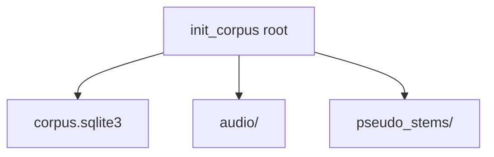
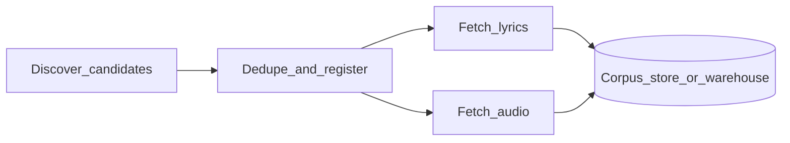

# Corpus ingestion and data pipelines

This document separates two ideas:

1. **Ingestion corpus** — building a library of tracks (metadata, optional lyrics, audio files on disk) for training or batch analysis.
2. **Mix analysis** — `song_analyzer.pipeline.analyze_mix` and the `song-analyzer analyze` CLI, which expect you already have a WAV (or similar) path.

It also clarifies what runs **in this repository today** versus a **target Apache Spark** workflow for discovery, lyrics, and audio at scale.

---

## Part A — What exists today

### Ingestion vs analysis

| Concern | Role |
|--------|------|
| **Corpus** (`song_analyzer.corpus`) | SQLite index + files under a corpus root: register tracks, attach lyrics text, point to audio files. |
| **Analysis** ([`pipeline.py`](../src/song_analyzer/pipeline.py)) | Demucs, optional NSynth labels, transcription, chords — input is a single mix file. |

The corpus layer does not call `analyze_mix` by itself; you would typically join “tracks with `audio_relpath` set” to your analysis jobs.

### Apache Beam (NSynth only)

This repo uses **Apache Beam** only as part of **TensorFlow Datasets** when downloading and preparing **`nsynth/full`** (training data for the instrument classifier). It is **not** used for finding songs, fetching lyrics, or downloading commercial audio.

Configuration (dill pickling, Windows `BundleBasedDirectRunner`, logging, memory hints) lives in [`nsynth_train_loop.py`](../src/song_analyzer/instruments/nsynth_train_loop.py). For full operational detail, see [PIPELINE_AND_TRAINING.md](PIPELINE_AND_TRAINING.md) (NSynth and observability sections).

### Corpus package layout

Initialize a corpus root with `init_corpus(root)` from [`song_analyzer.corpus.db`](../src/song_analyzer/corpus/db.py). That creates directories and `corpus.sqlite3` if missing.

**CLI note:** The database helper error message may mention `song-analyzer corpus init`; there is **no** `corpus` subcommand on the Typer CLI yet. Use `init_corpus(path)` from Python, or add a thin CLI wrapper later.

Optional HTTP dependencies for MusicBrainz: `pip install -e ".[corpus]"` (declared in `pyproject.toml` as the **`corpus`** extra, e.g. `httpx`).

### `tracks` table and the three ingestion stages

The schema is defined in [`db.py`](../src/song_analyzer/corpus/db.py). Logical mapping:

| Stage | Fields (conceptual) | Code touchpoints |
|-------|---------------------|------------------|
| **1. Discover / register** | `track_id`, `mbid`, `isrc`, `title`, `artist`, `source`, `source_id`, `raw_metadata_json`, `created_at`, `fetched_at` | [`TrackRecord`](../src/song_analyzer/corpus/types.py), [`TrackStore.insert_track`](../src/song_analyzer/corpus/store.py) |
| **2. Lyrics** | `lyrics_text`, `lyrics_source` | [`TrackStore.update_lyrics`](../src/song_analyzer/corpus/store.py), [`LyricsConnector`](../src/song_analyzer/corpus/connectors/protocol.py) |
| **3. Audio** | `audio_relpath`, `duration_seconds`, `file_checksum`, `fingerprint` | [`CorpusLayout.audio_file`](../src/song_analyzer/corpus/layout.py), file IO + hashing (callers) |

**Connectors and store**

- **MusicBrainz** — [`MusicBrainzClient`](../src/song_analyzer/corpus/connectors/musicbrainz.py): `fetch_recording(mbid)` returns title, artist, and raw JSON. There is no in-tree wrapper for large-scale “search / browse new releases”; that would be part of a discovery pipeline.
- **Lyrics** — [`LyricsConnector`](../src/song_analyzer/corpus/connectors/protocol.py) protocol; [`GeniusLyricsStubConnector`](../src/song_analyzer/corpus/connectors/stub.py) is a placeholder (`NotImplementedError`) with reminders about site terms and copyright.
- **Store** — [`TrackStore`](../src/song_analyzer/corpus/store.py): insert/update tracks, iterate tracks with audio, training manifest helpers, `resolve_audio_path`.

Relative audio paths are resolved under the corpus root via [`CorpusLayout`](../src/song_analyzer/corpus/layout.py) (`audio/` subdirectory).

---

## Part B — Target Apache Spark workflow (design)

There is **no PySpark or Spark job code in this repository** today. The following is a reference architecture for scaling the same three stages, aligned with `TrackRecord` and the corpus layout.

### Stage 1 — Find new songs

- **Inputs:** Curated ID lists, catalog exports, [MusicBrainz API](https://musicbrainz.org/doc/MusicBrainz_API) browse/search (with strict [etiquette](https://musicbrainz.org/doc/MusicBrainz_API): identifiable `User-Agent`, rate limits), or other licensed metadata feeds.
- **Spark role:** Partition candidates, normalize rows to match corpus identity fields, **deduplicate** on `mbid`, `isrc`, or stable external keys before insert.
- **Output:** Registered tracks with metadata; `lyrics_text` and `audio_relpath` may be null until later stages.
- **Practical constraint:** Global API rate limits rarely parallelize across hundreds of executors. Common patterns: low parallelism with shared throttling, **batch pre-export** (e.g. MB dumps) ingested as files, or a dedicated queue service feeding Spark batches.

### Stage 2 — Collect lyrics

- **Input:** Tracks where `lyrics_text` is missing (query or file feed of `track_id` + title/artist / licensed IDs).
- **Spark role:** `mapPartitions` / `foreachPartition` (or similar) to call a `LyricsConnector`-style implementation with **per-partition** rate limiting and retries.
- **Output:** Idempotent updates keyed by `track_id` (same lyrics fetched twice should overwrite safely).
- **Compliance:** Respect provider terms of service and copyright; the in-tree stub docstring in `stub.py` applies to any real connector you add.

### Stage 3 — Collect audio

- **Input:** Tracks missing `audio_relpath` (and optionally checksum/fingerprint).
- **Spark role:** Download or copy from an allowed archive; write bytes to object storage or a shared filesystem using the same naming convention as [`CorpusLayout.audio_file`](../src/song_analyzer/corpus/layout.py) (`audio/{track_id}.{ext}`) if you later sync to a local corpus tree.
- **Output:** Populate `audio_relpath`, `duration_seconds`, `file_checksum`; optionally `fingerprint` for dedupe across sources.

### Spark operational notes

- **Batch vs streaming:** Use batch jobs for periodic catalog sync; use Structured Streaming (or queue + micro-batch) if you need continuous “new track” intake.
- **Fault tolerance:** Checkpoint streaming queries; make writes **idempotent** (partition by `track_id`, upsert semantics).
- **SQLite:** Avoid opening the corpus `corpus.sqlite3` from many Spark executors concurrently. Prefer collecting small batches on the **driver**, JDBC **upsert** to PostgreSQL/MySQL, or a **lakehouse** table (Delta/Iceberg) and periodic export into the on-disk corpus layout for local `song-analyzer analyze` runs.

---

## See also

- [PIPELINE_AND_TRAINING.md](PIPELINE_AND_TRAINING.md) — mix analysis pipeline, NSynth, Beam.
- [MODELS.md](MODELS.md) — classifier and training stack.
- [PUBSUB_AND_BEAM.md](PUBSUB_AND_BEAM.md) — Pub/Sub topics, Beam streaming workers, and corpus `song.request` handling.
