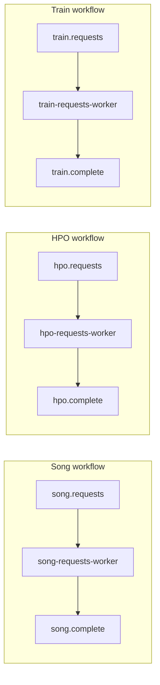

# Messaging: topics and JSON payloads

This document is the **canonical catalog** of Pub/Sub messages the Song Analyzer workers expect and emit. For emulator setup, Beam runners, and install extras, see [PUBSUB_AND_BEAM.md](PUBSUB_AND_BEAM.md).

## Overview

- Message bodies are **UTF-8 JSON** objects, validated with **Pydantic** models in [`src/song_analyzer/messaging/payloads.py`](../src/song_analyzer/messaging/payloads.py).
- Each workflow has a **correlation id** echoed on completion: `request_id` (song), `exploration_id` (HPO), `train_job_id` (train).
- The in-repo registry [`src/song_analyzer/messaging/workflows.py`](../src/song_analyzer/messaging/workflows.py) lists each workflow’s topics, default pull subscription (if any), and model types.

## Topic reference

| Topic | Role | Pull subscription created by `messaging setup-pubsub` | Payload model |
|-------|------|--------------------------------------------------------|---------------|
| `song.requests` | Publishers send work; workers pull | `song-requests-worker` | `SongRequestPayload` |
| `song.complete` | Workers publish results | *(none — add your own subscription if you need completions)* | `SongCompletePayload` |
| `hpo.requests` | Publishers send work; workers pull | `hpo-requests-worker` | `HpoRequestPayload` |
| `hpo.complete` | Workers publish results | *(none)* | `HpoCompletePayload` |
| `train.requests` | Publishers send work; workers pull | `train-requests-worker` | `TrainRequestPayload` |
| `train.complete` | Workers publish results | *(none)* | `TrainCompletePayload` |

## Song workflow (`song.requests` → `song.complete`)

**Purpose:** Expand the track corpus: optional MusicBrainz metadata, optional lyrics connector, optional copy of a local audio file into the corpus.

### `SongRequestPayload` (required / optional)

| Field | Required | Default | Notes |
|-------|----------|---------|--------|
| `request_id` | yes | — | Correlates with `SongCompletePayload.request_id`. |
| `corpus_root` | yes | — | Filesystem path to corpus root. |
| `mbid` | no | `null` | MusicBrainz recording id. |
| `title` | no | `null` | |
| `artist` | no | `null` | |
| `source` | no | `"pubsub"` | |
| `source_id` | no | `null` | |
| `local_audio_path` | no | `null` | If set, copy or reference this file into the corpus (licensed/local use only). |
| `copy_audio` | no | `true` | |
| `lyrics_connector` | no | `"genius"` | In-tree connector may be a stub (`NotImplementedError` → no lyrics). |
| `musicbrainz_user_agent` | no | `null` | |
| `musicbrainz_enrich` | no | `true` | When `mbid` is set, enrich title/artist from MusicBrainz. |

### `SongCompletePayload`

| Field | Notes |
|-------|--------|
| `request_id` | Same as request. |
| `status` | `"ok"` or `"error"`. |
| `track_id` | Set on success when a track is created or resolved. |
| `audio_relpath` | Relative path under corpus when audio was ingested. |
| `lyrics_fetched` | `true` if lyrics were stored. |
| `error` | Human-readable message when `status` is `"error"`. |

Semantics match [`process_song_request`](../src/song_analyzer/corpus/song_request.py): failures return `status: "error"` and `error` set; success returns `status: "ok"` with `track_id` and optional `audio_relpath`.

## HPO workflow (`hpo.requests` → `hpo.complete`)

**Purpose:** Run NSynth hyperparameter search (Optuna). Default configuration uses `skip_final_train: true` so full training is a separate `train.request`.

### `HpoRequestPayload`

| Field | Required | Default | Notes |
|-------|----------|---------|--------|
| `exploration_id` | yes | — | Correlates with `HpoCompletePayload.exploration_id`. |
| `n_trials` | no | `20` | |
| `device` | no | `"cuda"` | |
| `tune_cache_dir` | no | `null` | Optuna / tune cache root. |
| `tfds_data_dir` | no | `null` | TensorFlow Datasets dir for NSynth. |
| `max_val_steps` | no | `200` | |
| `final_epochs` | no | `3` | Used when final training runs inside HPO. |
| `final_max_steps_per_epoch` | no | `500` | |
| `no_tune_cache` | no | `false` | |
| `tune_fresh` | no | `false` | |
| `archive_tune_db_before` | no | `true` | Archive SQLite DB before run when enabled. |
| `skip_final_train` | no | `true` | If `true`, only Optuna; use `train.requests` for full train. |
| `out_checkpoint` | no | `null` | When `skip_final_train` is `false`, final `.pt` path. |
| `log_level` | no | `"INFO"` | |

### `HpoCompletePayload`

| Field | Notes |
|-------|--------|
| `exploration_id` | Same as request. |
| `status` | `"ok"` or `"error"`. |
| `study_name` | Optuna study name (use for `TrainRequestPayload.study_name` when chaining). |
| `best_params` | Best trial params when `status` is `"ok"`. |
| `best_value` | Best objective when `status` is `"ok"`. |
| `archived_db_path` | Path to archived DB when archiving ran. |
| `trials_csv_path` | Exported trials CSV path when produced. |
| `out_checkpoint` | Written checkpoint when final train ran inside HPO. |
| `error` | Set when `status` is `"error"`. |

Handler logic: [`handle_hpo_bytes`](../src/song_analyzer/beam/handlers.py).

## Train workflow (`train.requests` → `train.complete`)

**Purpose:** Train NSynth classifier from an existing Optuna study (best params).

### `TrainRequestPayload`

| Field | Required | Default | Notes |
|-------|----------|---------|--------|
| `train_job_id` | yes | — | Correlates with `TrainCompletePayload.train_job_id`. |
| `study_name` | yes | — | Must match the study from HPO (`HpoCompletePayload.study_name` on success). |
| `tune_cache_dir` | no | `null` | Should match HPO run when studies live on disk. |
| `out` | yes | — | Output `.pt` path. |
| `epochs` | no | `3` | |
| `max_steps_per_epoch` | no | `500` | |
| `max_val_steps` | no | `null` | |
| `device` | no | `"cuda"` | |
| `tfds_data_dir` | no | `null` | Typically same as HPO. |
| `log_level` | no | `"INFO"` | |

### `TrainCompletePayload`

| Field | Notes |
|-------|--------|
| `train_job_id` | Same as request. |
| `status` | `"ok"` or `"error"`. |
| `checkpoint_path` | On success, matches request `out`. |
| `best_params_used` | Params loaded from the study when `status` is `"ok"`. |
| `error` | Set when `status` is `"error"`. |

Handler logic: [`handle_train_bytes`](../src/song_analyzer/beam/handlers.py).

## Chaining HPO → train

1. Publish `HpoRequestPayload` to `hpo.requests` and consume `hpo.complete`.
2. On `status: "ok"`, read `study_name` from the completion.
3. Publish `TrainRequestPayload` to `train.requests` with the same `study_name`, and align `tune_cache_dir` / `tfds_data_dir` with the HPO run so the study and data resolve.

## Operational notes

- **Invalid JSON or schema mismatch** fails at the worker when Pydantic validates the request body (message is not acked as successful processing depending on runner behavior; fix the payload and retry).
- **Ordering:** [`publish_json`](../src/song_analyzer/messaging/publish.py) accepts an optional `ordering_key`; the CLI publish commands do not expose it.
- **Sample JSON:** `song-analyzer messaging print-sample-payloads` prints example request and completion objects for each workflow.

## GCP and tooling

The same topic names and JSON shapes work against the Pub/Sub emulator or Google Cloud; see [PUBSUB_AND_BEAM.md](PUBSUB_AND_BEAM.md) for migration and Beam runner notes.
