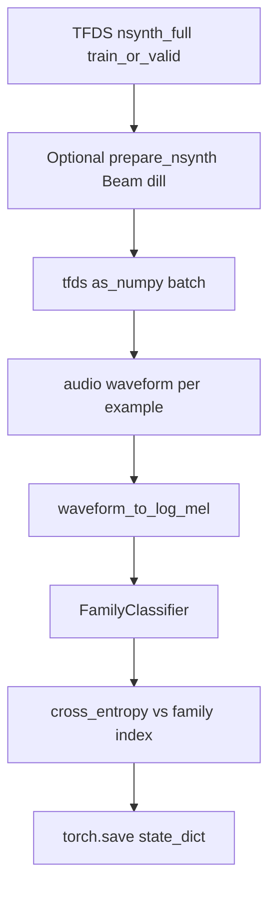
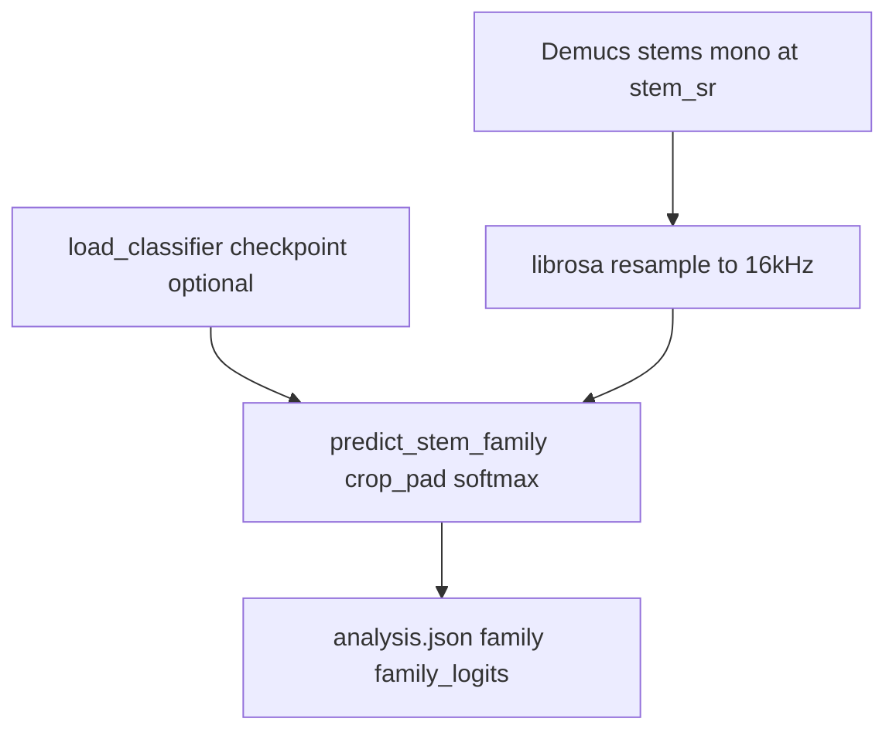

# Model registry and per-model pipelines

This document lists every model that affects analysis or training, whether it is **trained in this repository** or **pretrained upstream**, and how data flows through each. For end-to-end mix analysis, staged passes, NSynth dataset preparation, Optuna tuning, and logging details, see [PIPELINE_AND_TRAINING.md](PIPELINE_AND_TRAINING.md).

## Inventory

| Model / component | Role | Trained here | Artifact / source | Code entrypoints | CLI |
|-------------------|------|--------------|-------------------|------------------|-----|
| **FamilyClassifier** | Instrument **family** label per stem (and per timbre chunk in staged mode) | Yes | PyTorch `state_dict` `.pt` (weights only) | [`model.py`](../src/song_analyzer/instruments/model.py), [`mel.py`](../src/song_analyzer/instruments/mel.py), [`infer.py`](../src/song_analyzer/instruments/infer.py), [`train_nsynth.py`](../src/song_analyzer/instruments/train_nsynth.py), [`nsynth_train_loop.py`](../src/song_analyzer/instruments/nsynth_train_loop.py) | `song-analyzer train-nsynth`, `prepare-nsynth` |
| **Demucs** | Source separation into stems | No (pretrained checkpoint) | Loaded by name via `demucs` / torch hub | [`demucs_sep.py`](../src/song_analyzer/separation/demucs_sep.py), [`pipeline.py`](../src/song_analyzer/pipeline.py) | `song-analyzer analyze --demucs-model …` |
| **Transcription backend** | Monophonic-ish note events per stem | No | Basic Pitch (optional extra) or librosa heuristic | [`transcribe.py`](../src/song_analyzer/pitch/transcribe.py), [`iterative_extract.py`](../src/song_analyzer/pitch/iterative_extract.py) | Install `[basicpitch]` for Basic Pitch |

Optional evaluation hook (not training): [`scripts/eval_musdb.py`](../scripts/eval_musdb.py) (stub for MUSDB18 / museval vs Demucs).

---

## Trained model: `FamilyClassifier`

### Purpose

Maps a short mono waveform at **16 kHz** to one of **11** NSynth-aligned instrument families (bass, brass, flute, guitar, keyboard, mallet, organ, reed, string, synth_lead, vocal). Used for full-stem labels in [`pipeline.analyze_mix`](../src/song_analyzer/pipeline.py) and for timbre sample rows in staged mode via [`solo/timbre_map.py`](../src/song_analyzer/solo/timbre_map.py).

Class order must match TensorFlow Datasets NSynth: [`constants.py`](../src/song_analyzer/instruments/constants.py) (`NSYNTH_FAMILIES`, `NUM_NSYNTH_FAMILIES`).

### Architecture and I/O

- **Implementation:** small CNN on **log-mel** spectrogram ([`FamilyClassifier`](../src/song_analyzer/instruments/model.py)): Conv2d blocks with batch norm, max-pool, adaptive average pool, linear head to `num_classes`.
- **Frontend:** [`waveform_to_log_mel`](../src/song_analyzer/instruments/mel.py) — `SAMPLE_RATE=16000`, `N_MELS=64`, `N_FFT=1024`, `HOP_LENGTH=160` (100 frames/s), `log(power + 1e-6)`, output batch shape `(1, 1, n_mels, time_frames)`.
- **Training:** one forward per example inside each TFDS batch (see below); targets are `batch["instrument"]["family"]` as `int64`.
- **Inference:** [`predict_stem_family`](../src/song_analyzer/instruments/infer.py) center-crops or zero-pads the stem to **~1.6 s** at 16 kHz, then softmax over logits. If no checkpoint is loaded, returns family `"unknown"`, confidence `0.0`, and **uniform** probabilities over all labels.

### Training pipeline

- **Data:** TensorFlow Datasets `nsynth/full`, splits `train` / `valid`; cache under `TFDS_DATA_DIR`, `--tfds-data-dir`, or default TFDS home.
- **Loop:** [`run_nsynth_split`](../src/song_analyzer/instruments/nsynth_train_loop.py) / [`_run_batches`](../src/song_analyzer/instruments/nsynth_train_loop.py): for each batch, for each sample, `waveform_to_log_mel` → model → `F.cross_entropy`; backward per batch when training.
- **Checkpoint:** weights only (`model.state_dict()`), not optimizer or epoch state. Hyperparameter search: `song-analyzer train-nsynth --tune` ([`tune_nsynth.py`](../src/song_analyzer/instruments/tune_nsynth.py)).

Full operational detail (Beam on Windows, observability, Optuna fingerprint): [PIPELINE_AND_TRAINING.md](PIPELINE_AND_TRAINING.md) (NSynth sections).

### Inference pipeline (within mix analysis)

- **Checkpoint:** path from `--nsynth-checkpoint` or env `SONGANALYZER_NSYNTH_CHECKPOINT`; [`load_classifier`](../src/song_analyzer/instruments/infer.py) uses [`build_model`](../src/song_analyzer/instruments/mel.py) then `load_state_dict`.

### Training vs inference alignment

The same **`waveform_to_log_mel`** and **`FamilyClassifier` topology** (`build_model`) are used for training and inference, so mel geometry and class count stay consistent. Inference adds fixed-length crop/pad on the **time** axis only; training uses variable-length NSynth clips passed through the same mel transform.

---

## Pretrained dependencies

### Demucs

Loads a **named** pretrained separation model, runs at the model’s sample rate, returns a dict keyed by **`model.sources`** (e.g. `htdemucs`: drums, bass, other, vocals). Mono mixes are duplicated to stereo where required. See [`separation/README.md`](../src/song_analyzer/separation/README.md) for model names vs stem sets.

### Transcription (Basic Pitch vs librosa)

[`transcribe_stem`](../src/song_analyzer/pitch/transcribe.py) chooses **Basic Pitch** when `prefer_basic_pitch` is true and `basic_pitch` is importable; otherwise **librosa**-based pitch tracking (`librosa_pyin` in metadata). The analysis pipeline and iterative peel pass `prefer_basic_pitch=True` by default.

---

## Adding a new trained model

When you introduce another trainable model:

1. Add a row to the **Inventory** table above (role, artifact format, entrypoints, CLI).
2. Add a section with **architecture / I/O**, **training** data flow (diagram optional), and **inference** hook points in `pipeline` or submodules.
3. Wire **documentation** from [README.md](../README.md) and, if training is non-trivial, extend [PIPELINE_AND_TRAINING.md](PIPELINE_AND_TRAINING.md) with ops (data paths, caches, env vars).

Keeping this file as the registry avoids scattering “what models exist” across README-only bullets.
