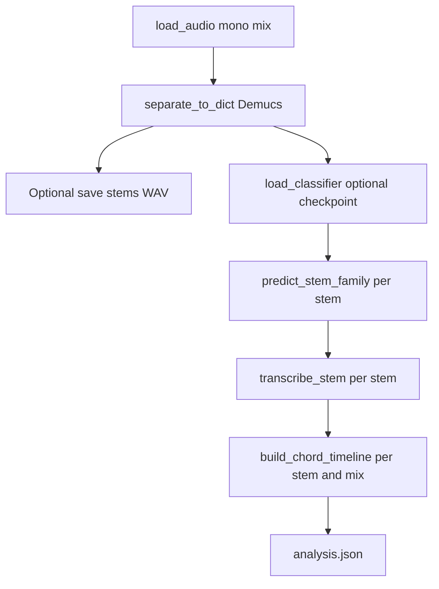
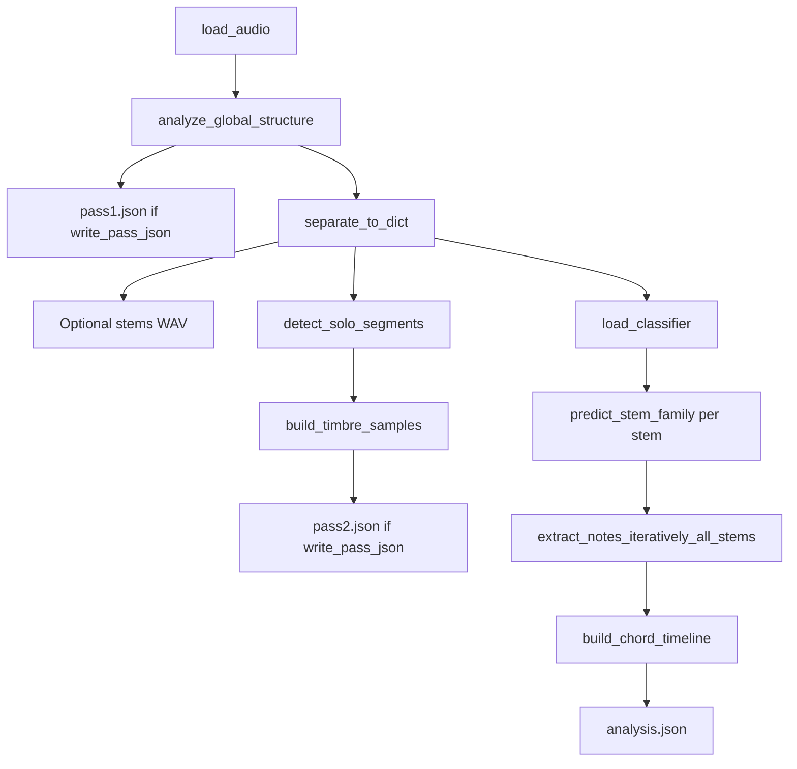
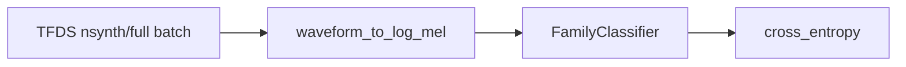

# Analysis pipeline and NSynth training

This document describes how a full mix is analyzed (including the optional staged path), what files are written, how NSynth data flows into training and tuning, and what state is persisted on disk.

For a **registry of all models** (trained vs pretrained), per-model I/O, and training/inference pipelines for `FamilyClassifier`, see [MODELS.md](MODELS.md).

## Mix analysis (`analyze_mix`)

Entry point: `song_analyzer.pipeline.analyze_mix` (CLI: `song-analyzer analyze`).

### Default path (`use_staged=False`)

### Staged path (`use_staged=True`, CLI `--staged`)

Pass 1 runs on the **full mix** before separation. Pass 2 uses **separated stems** for solo detection and timbre sampling. Pass 3 runs iterative note extraction.

**Order of operations (staged):** global structure on mix → Demucs → optional stem files → solo segments and timbre samples (classifier used inside timbre sampling) → full-stem family prediction for each stem → iterative peel → chords.

### Artifacts on disk

| Path | When |
|------|------|
| `stems/*.wav` | Unless `write_stem_wavs=False` (CLI: `--no-stem-wavs`) |
| `analysis.json` | Always (full `AnalysisResult`) |
| `pass1.json` | `use_staged=True` and `write_pass_json=True` (default); serialized `GlobalStructureResult` |
| `pass2.json` | Same as pass1; small debug JSON: `solo_segments`, `timbre_sample_count`, `demucs_sources` — not a dump of all `TimbreSample` rows (those live in `analysis.json`) |

### `AnalysisResult.meta` (analysis pipeline)

Written in `pipeline.analyze_mix` (keys may be extended over time):

- `demucs_model`, `stem_sample_rate`, `pitch_transcription` — backend label (e.g. iterative path sets `iterative_peel` with optional `backend_hint` from peel metadata).
- `nsynth_checkpoint_used` — whether a checkpoint was loaded.
- `use_staged`, `restrict_iterative_to_solo` — staged flags.
- `iterative_extraction` — present when staged; peel metadata including `per_stem` details when available.

Full schema: `song_analyzer.schema.AnalysisResult` and nested models.

---

## NSynth data and training

See also: [MODELS.md](MODELS.md) (FamilyClassifier architecture and pipeline diagrams).

Training code lives under `song_analyzer.instruments`. Shared batching and TFDS loading: `nsynth_train_loop.py`. High-level training: `train_nsynth.py`. Hyperparameter search: `tune_nsynth.py`.

### Data source

- Dataset: TensorFlow Datasets **`nsynth/full`**, splits `train` and `valid`.
- Cache directory: `--tfds-data-dir` (CLI), or environment variable **`TFDS_DATA_DIR`**, or default **`~/tensorflow_datasets`** (platform-specific home).

First-time **`download_and_prepare`** is slow and CPU-heavy. The codebase passes Beam options so NSynth preparation uses **dill** for pickling (avoids recursion issues with default cloudpickle paths). On **Windows**, a **`BundleBasedDirectRunner`** is set so preparation stays in-process and avoids common portable-runner timeouts.

If a dataset folder exists but is not readable, `run_nsynth_split` raises a **`RuntimeError`** with guidance to delete the incomplete cache and retry.

### Observability (Beam logs, process memory, Dataflow)

- **Console and file logging:** NSynth CLIs attach a **colored** stderr handler when stderr is a TTY (via **`colorlog`** from **`pip install -e ".[train]"`**) and append plain-text logs to a file. By default, **prepare** writes **`nsynth_prepare.log`** and **train/tune** writes **`nsynth_train.log`** under **`%LOCALAPPDATA%\song_analyzer\logs`** on Windows or **`~/.cache/song_analyzer/logs`** elsewhere. Override with **`--log-file PATH`** or disable the file with **`--no-log-file`** on `song-analyzer prepare-nsynth` and `song-analyzer train-nsynth`.
- **Verbose Beam / TF / TFDS:** pass **`--log-level DEBUG`** to `song-analyzer prepare-nsynth` or the `train_nsynth` / `tune_nsynth` CLIs. Logging setup then sets the **`apache_beam`**, **`tensorflow`**, and **`tensorflow_datasets`** loggers to DEBUG so pipeline and library messages are not suppressed by default library levels.
- **Process memory during local prepare:** with **`DirectRunner`** / **`BundleBasedDirectRunner`**, work runs in **one Python process**—there are no separate Beam worker VMs. Use **`song-analyzer prepare-nsynth --log-rss-interval-seconds 30`** (requires **`psutil`** from **`pip install -e ".[train]"`**) to log **RSS/VMS** periodically while **`download_and_prepare`** runs, or watch the process in Task Manager / Resource Monitor.
- **Google Cloud Dataflow:** if you configure TFDS with a **Dataflow** (or other distributed) **`beam_runner`**, use the **Dataflow job page** in Google Cloud Console, **Cloud Monitoring** metrics for worker memory and CPU, and **Cloud Logging** for worker logs. That path is optional and not wired by default in this repo.

### Training loop (conceptual)

- Each batch provides waveform and `instrument.family` indices.
- `train_nsynth_run` (`train_nsynth.py`) caps **steps per epoch** (`max_steps_per_epoch`) and optionally runs **validation** each epoch when `max_val_steps` is set.
- Checkpoints are written with **`torch.save(model.state_dict(), path)`** — **weights only**, not optimizer state, epoch counter, or scheduler.

### Loading checkpoints in analysis

`infer.load_classifier` builds a `FamilyClassifier`, then **`load_state_dict`** on the saved tensor dict. Use **`SONGANALYZER_NSYNTH_CHECKPOINT`** or **`--nsynth-checkpoint`** on `song-analyzer analyze` so instrument predictions use trained weights instead of the uniform fallback.

---

## Tuning state (Optuna)

When you run **`song-analyzer train-nsynth --tune`**:

1. Optuna minimizes **validation loss** from the **last epoch** of each trial (validation uses up to **`max_val_steps`** batches per epoch inside the trial; CLI defaults this cap when tuning).
2. After trials complete, **`train_nsynth_run`** runs the **final** training with the best hyperparameters. In the current implementation that final run uses **`max_val_steps=None`**, so it does **not** run per-epoch validation during the final fit — only the capped validation inside Optuna trials informs hyperparameters.

**Persistent study (default):**

- Directory: `default_tune_cache_dir()` → typically **`~/.cache/song_analyzer/tune`** (or `$XDG_CACHE_HOME/song_analyzer/tune` when set).
- SQLite file: **`nsynth_tune.db`**.
- Study name: **`nsynth_family_<suffix>`** where `suffix` is the first 12 hex characters of a hash of a **fingerprint payload** (`nsynth_tune_fingerprint.py`).

The fingerprint includes:

- NSynth builder **dataset version**
- **SHA-256 of instrument training sources** listed in `FINGERPRINT_SOURCE_NAMES` (e.g. `train_nsynth.py`, `nsynth_train_loop.py`, `mel.py`, `model.py`, `tune_nsynth.py`, …)
- **`FINGERPRINT_SALT`** — bump when something outside those files changes training semantics
- Installed **`tensorflow`** and **`tensorflow-datasets`** versions (strings)

So a new study name (fresh cache behavior) follows from code changes, dataset version bumps, salt bumps, or TF package version changes.

**CLI flags:**

- **`--no-tune-cache`** — in-memory Optuna only; no resume across runs.
- **`--tune-fresh`** — delete the existing study for the current fingerprint and start over.
- **`--tune-cache-dir`** — override the directory containing `nsynth_tune.db`.

---

## Quick reference

| Concern | Where |
|--------|--------|
| Mix pipeline implementation | `src/song_analyzer/pipeline.py` |
| Staged peel / solo | `pitch/iterative_extract.py`, `solo/` |
| NSynth train CLI | `src/song_analyzer/cli.py` → `train-nsynth` |
| NSynth run API | `train_nsynth.train_nsynth_run` |
| TFDS + batches | `nsynth_train_loop.run_nsynth_split` |
| Checkpoint load | `infer.load_classifier` |
